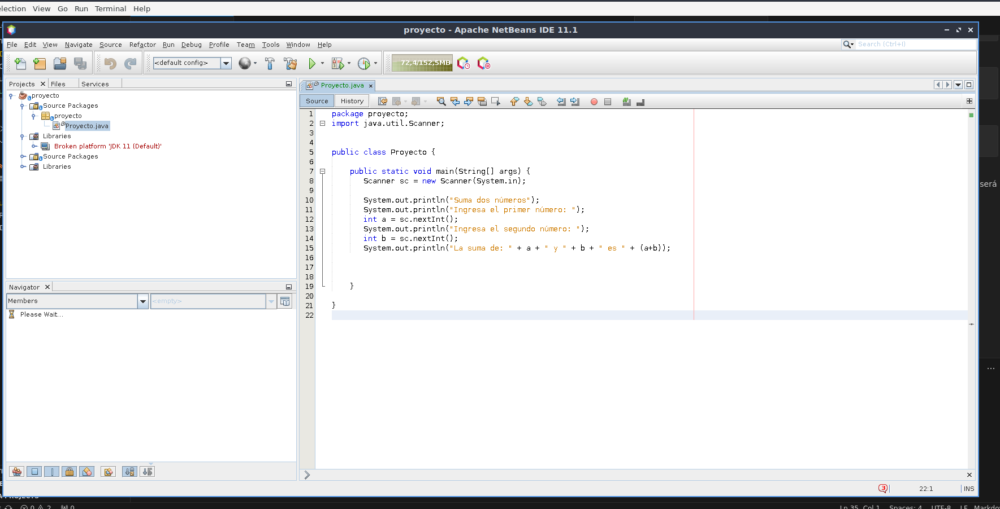
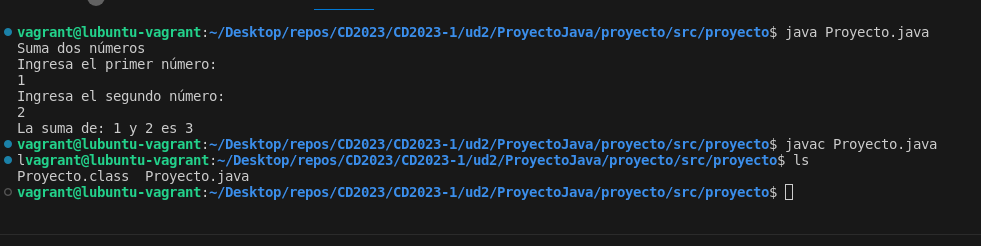

## Opción de IDE para una aplicación

### NetBeans
- Es un entorno de desarollo de código abierto.
- Es el IDE oficial de Java pero también soporta: PHP, C, C++ e incluso HTML 5.
- Funciona tanto en Windows como en Linux

### Instalación en Ubuntu
- En primer lugar, siempre es recomendable actualizar los repositorios:
``` bash
$ sudo apt update
```
- Ahora, instala el Java JDK versión 11 por defecto (Puede ser que tu equipo ya lo tenga.)
``` bash
$ sudo apt install default-jdk
```
- Podemos comprobar que versión de Java tenemos con:
``` bash
$ java --version
```
- Necesitamos agregar el repositorio universal de Ubuntu:
``` bash
$ sudo add-apt-repository "deb http://archive.ubuntu.com/ubuntu focal universe"
```
- Volvemos a actualizar los repositorios:
``` bash
$ sudo apt update
```
- Instalamos NetBeans con apt:
``` bash
$ sudo apt install netbeans
```

### Crear un Programa Java

- Ya podemos utilizar netbeans.


- Abrimos NetBeans y configuramos nuestro programa sencillo, en mi caso será una calculadora simple.



- Vemos que se ejecuta y compila correctamente




!!ADVERTENCIA¡¡: Nuestro JDK tiene que tener la misma versión que NetBeans, si no, nos saldra el siguiente error:


``` bash
cannot access java.lang
Fatal Error: Unable to find package java.lang in classpath or 
bootclasspath
```